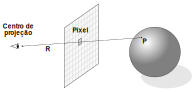
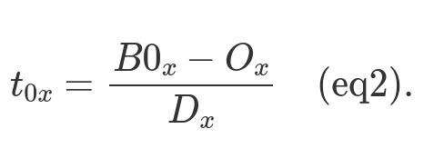
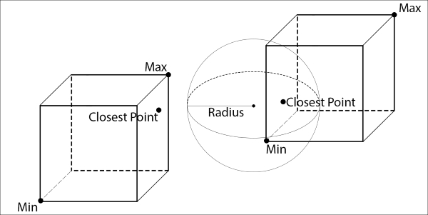
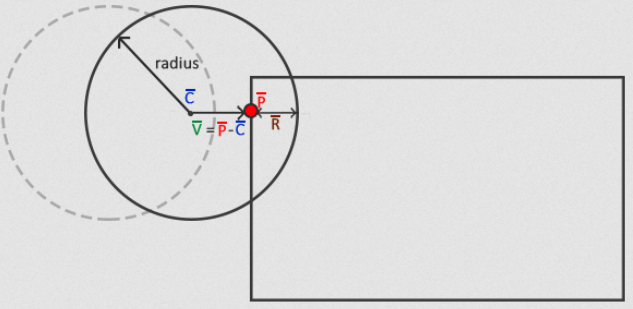
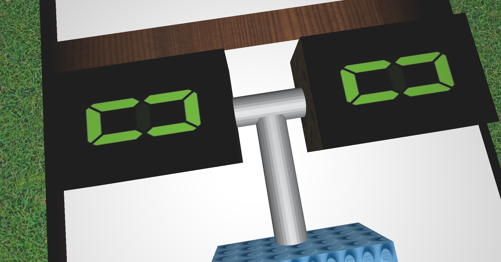
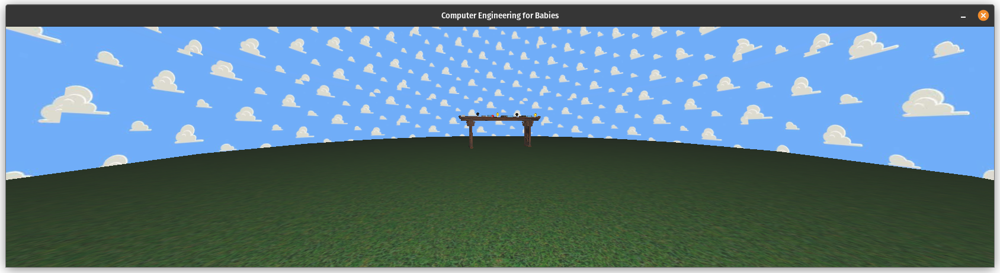
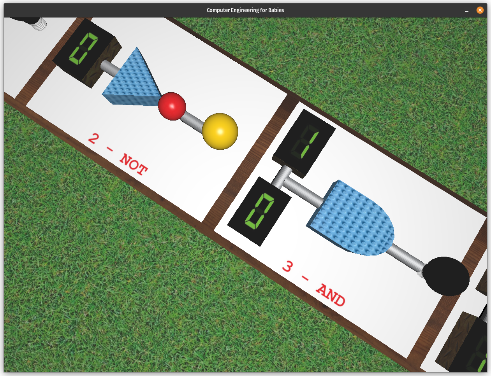
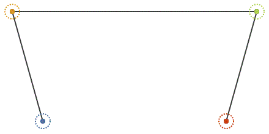

# "Computer Engineering for Babies"
Implementação em OpenGL de circuitos digitais booleanos básicos, em uma simulação interativa e lúdica. Inspirado pelo [livro homônimo de Chase Roberts](https://computerengineeringforbabies.com/?srsltid=AfmBOorB6rgQBVJv4aZhZNOSCN61UN0Kq22ZK3XgHsCch2F3tUFedHHC).

# Contribuição

**Beatriz Forneck Soviero**
- Ideia do projeto e implementação inicial, a partir dos laboratórios;
- [Implementação dos objetos e circuitos Wire, NOT, AND e OR;](https://github.com/leonardoazzi/compeng-for-babies/pull/14)
- [Criação dos circuitos e lógica troca de estados com mudança de texturas](https://github.com/leonardoazzi/compeng-for-babies/pull/54)
- [Modelos de iluminação](https://github.com/leonardoazzi/compeng-for-babies/pull/38)
- [Animação com curva de Bézier cúbica](https://github.com/leonardoazzi/compeng-for-babies/pull/51)
- [Mapeamento individual dos inputs](https://github.com/leonardoazzi/compeng-for-babies/pull/54)
- [Adição da SkySphere](https://github.com/leonardoazzi/compeng-for-babies/pull/56)
- [Pesquisa e customização de texturas](https://github.com/leonardoazzi/compeng-for-babies/pull/61)

**Leonardo Azzi Martins**
- [Implementação de câmera livre e mudança entre câmeras;](https://github.com/leonardoazzi/compeng-for-babies/pull/28)
- [Teste de intersecção AABB-AABB](https://github.com/leonardoazzi/compeng-for-babies/pull/35)
- [Teste de intersecção raio-AABB para interação com input dos circuitos](https://github.com/leonardoazzi/compeng-for-babies/pull/37)
- [Teste de intersecção esfera-AABB](https://github.com/leonardoazzi/compeng-for-babies/pull/39)
- [Rotação dos circuitos com mouse e teclado](https://github.com/leonardoazzi/compeng-for-babies/pull/50)
- [Wrapping de texturas e customização](https://github.com/leonardoazzi/compeng-for-babies/pull/52)
- [Limita a câmera livre para não atravessar plano xz](https://github.com/leonardoazzi/compeng-for-babies/pull/57)
- [Resolução de bouncing para colisões esfera-AABB e ponto-esfera](https://github.com/leonardoazzi/compeng-for-babies/pull/63)

# Uso de Large Language Models

Utilizamos o Github Copilot com dois objetivos: acelerar a codificação repetitiva com o auto complete, e ajudar na criação de métodos e funções com prompt engineering. Sua principal aplicação foi no módulo collisions.cpp, onde maior parte das implementações necessitou de um material complementar. O auto complete foi bastante útil para diminuir o tempo de desenvolvimento de cada funcionalidade, pois os erros do Copilot são rapidamente minimizados ao prover maior contexto na linha de código. Já a função de chat dentro do editor foi utilizada para tentar escrever ou reescrever funções. Esta tarefa depende muito do contexto dado ao Copilot e do prompt descrito. Além disto, como o escopo em geral era maior do que com o auto complete, na maioria das vezes gerou linhas de código que necessitaram minutos ou horas adicionais de debug. O uso da ferramenta pode ajudar a garantir uma solução funcional, mas não garante aprendizado. 

Portanto, demos ênfase em referências reais para o desenvolvimento das colisões. Já chat fora do editor foi utilizado como uma forma de traduzir dúvidas ou problemas com um vocabulário menos específico, já que o chat tem o contexto do código-fonte, o que foi útil para direcionar dúvidas e realizar buscas externas. Assim, particularmente, acreditamos que o auto complete foi a melhor funcionalidade do Github Copilot para projetos práticos, principalmente em um semestre reduzido como este.

Utilizamos também o ChatGPT para a geração dos modelos das portas lógicas AND e NOT. O prompt utilizado pedia para dar as instruções necessárias para criar os formatos dos modelos desejados a partir de um plano 2D. O ChatGPT foi útil para gerar as instruções certas mas não conseguiu prover um modo de criar a porta OR.

Também tentamos utilizar os modelos generativos LGM Mini e splat-to-mash sugeridos pelo Prof. Gastal, mas não obtivemos bons resultados pela falta de imagens de referência com blocos reais que representam a forma dos circuitos.

# Processo de desenvolvimento e conceitos de CG

Iniciamos o projeto a partir da prática dos laboratórios de 1 a 5, alguns adiantados, onde podemos colocar na prática conceitos sobre as estruturas de dados, renderização, pipeline gráfica, transformações hierárquicas, modelos de iluminação e mapeamento de texturas. A partir da ideia inspirada no livro, foi criado o primeiro protótipo que continha a mesa e os circuitos Wire, NOT e AND. O input dos circuitos foi mapeado a partir do input do teclado e passado para o fragment shader, onde realiza a lógica booleana para a troca de texturas de acordo com os inputs.

## Câmera

A partir da câmera look-at, tivemos o desafio inspirado no Laboratório 2 de implementar a câmera livre. Implementamos as matrizes de transformação para completar a pipeline gráfica, de coordenadas do objeto para coordenadas NDC, com projeções ortográfica e perspectiva. O input de movimento do ponto 'c' da câmera foi mapeado para as teclas 'WASD'. O ângulo da câmera é modificado com o cálculo em coordenadas polares, a partir do movimento do mouse enquanto pressiona o botão esquerdo. A coordenada y do ponto 'c' da câmera é fixada em 1.0f, para simular uma pessoa de altura regular caminhando no ambiente do cenário.

## Circuitos e objetos

Todos os circuitos e seus elementos foram posicionados utilizando um mesmo `Model matrix`, o que facilitou o uso de transformações hierárquicas de modo que as posições dos circuitos eram relativas ao tamanho da mesa e os elementos como os blocos, fios, displays e lâmpadas eram baseadas na largura de cada circuito.

Os blocos foram modelados com o Blender, e objetos como a mesa e a lâmpada foram obtidos de repositórios de assets 3D, como o [PolyHaven](https://polyhaven.com/). Todos este objetos são importados em objects.cpp, em formato .obj. Os objetos criados no Blender exigiram a customização das coordenadas de textura, o que envolveu os conceitos aprendidos na disciplina em mapeamento de texturas.

## Testes de intersecção
  
Foram implementados três testes de intersecção: raio-AABB, esfera-AABB e ponto-esfera. 

A Axis-Aligned Bounding Box (AABB) foi implementada a partir da obtenção das coordenadas locais mínima e máxima de cada SceneObject de interesse. Uma AABB é sempre orientada com o sistema cartesiano do mundo, facilitando o teste de intersecção e consumindo menos memória, pois armazena apenas um ponto mínimo e um ponto máximo. Cada AABB, dentro do contexto das transformações hierárquicas, é convertido em coordenadas de mundo. Implementou-se uma struct AABB, que guarda o ponto mínimo e máximo de cada objeto ou conjunto de objetos.

A partir disto, foi desenvolvido o Ray Casting, que projeta um raio da câmera para a cena, a partir da transformada inversa das coordenadas do mouse na tela até as coordenadas do mundo. Assim, relaciona a posição do mouse com o primeiro objeto atingido pelo raio no mundo.

Imagem: https://www.brunodorta.com.br/cg/ray-casting-x-rasteriza%C3%A7%C3%A3o.html

O teste de intersecção entre o raio e uma AABB se baseia em um [ray tracer mínimo](https://www.scratchapixel.com/lessons/3d-basic-rendering/minimal-ray-tracer-rendering-simple-shapes/ray-box-intersection.html). Este teste se baseia na equação de reta, analisando o coeficiente angular em relação aos eixos do sistema de coordenadas, que são paralelos às retas das AABBs. O raio pode ser expresso como a equação da reta em um espaço tridimensional, onde ela é subdividida em componentes para cada face bidimensional de uma AABB. Na equação abaixo, B0_x é o componente x da coordenada mínima de uma AABB, O_x é a componente x da origem do raio (câmera), e D_x é a componente x da direção do raio. t é um valor real, onde t_0 representa a reta intersectando a coordenada mínima e t_1 a coordenada máxima. Se t for negativo, significa que as intersecções estão atrás da câmera e podem ser descartadas. 

Esta equação é calculada para as coordenadas mínimas e máximas da AABB, em todas as componentes do sistema de coordenadas. Para determinar se o raio intersecta o cubo como um todo, e para isto são selecionados os valores mínimos e máximos de t. Com isto, verifica-se se estes raios podem estar fora da cubo. Se os valores t_min e t_max estão dentro do cubo, a intersecção é positiva.

Imagens: https://www.scratchapixel.com/lessons/3d-basic-rendering/minimal-ray-tracer-rendering-simple-shapes/ray-box-intersection.html

Este teste é utilizado como controle dos displays, combinado com o clique do mouse para alterar os estados de input e recarregar os shaders para renderizar os dígitos e a lâmpada. Também é utilizado para definir o parâmetro isHovered dos circuitos, utilizado para escolher os circuitos que a rotação será aplicada em Y.

A esfera de colisão foi definida também como uma Struct, que armazena a posição do seu centro e o seu raio. O teste de intersecção [esfera-AABB](https://learnopengl.com/In-Practice/2D-Game/Collisions/Collision-detection) busca o ponto da AABB mais próximo à esfera, calculando sua distância. Se a distância entre a esfera e o ponto for menor que o raio da esfera, então a colisão entre a esfera e a AABB é detectada.

Imagem: https://learnopengl.com/In-Practice/2D-Game/Collisions/Collision-detection

Foi implementada uma resolução para a colisão esfera-AABB e aplicada entre a câmera livre (esfera) e o conjunto da mesa com os circuitos (AABB). Para isto, é calculado o ponto mais da AABB até o centro da esfera, no caso o centro da câmera, criando um vetor do ponto mais próximo até o centro da câmera, calculando em seguida o módulo para obter o seu tamanho. Se o tamanho do vetor entre a AABB e o centro da esfera for menor que o raio da esfera, existe intersecção. Adicionalmente, foi incluindo um operador AND nesta condição para avaliar a colisão apenas se este módulo for maior que 0.1f, para evitar os valores menores ou iguais a 0.0f que podem causar bugs na resolução física. Cumprida esta condição, calcula-se o vetor de deslocamento, que representa o quanto a AABB intersecta com a esfera da câmera. Este vetor é retornado e subtraído do vetor de movimento da câmera, para que não atravesse o objeto representado pela AABB. Para esta resolução não utilizou-se referências, sendo deduzida com auxílio do Github Copilot na codificação, pois a solução é relativamente simples.

Imagem: https://learnopengl.com/img/in-practice/breakout/collisions_aabb_circle_resolution.png

Por fim, implementou-se o teste de intersecção ponto-esfera. Este teste é o mais trivial, pois calcula a distância euclidiana entre o ponto e o centro da esfera, e o teste retorna positivo se a distância euclidiana for maior ou igual ao raio quadrado da esfera.

A resolução para a colisão ponto-esfera foi aplicada entre o ponto central da câmera e a esfera skySphere, que representa o background do cenário, com objetivo de que câmera livre não ultrapasse o cenário. Calcula-se o vetor entre o ponto e o centro da esfera e, para fins de simplificação, reduz sua dimensão para o plano xz, pois a coordenada y da câmera livre é limitada em 1.0f. Calcula-se o vetor que define o raio da esfera, inicialmente alinhado com o eixo x e com um offset, para que a hitsphere seja ligeiramente menor do que a esfera, evitando que a câmera atravesse o objeto mesmo com a colisão. O ângulo do vetor raio é rotacionado para ser paralelo com o vetor de direção ponto-centro, para ser possível compará-los sem o offset angular. A partir do módulo destes dois vetores, se o vetor entre ponto-centro for maior que o raio da hitsphere, calcula-se o vetor de offset, que é representa a intersecção do ponto, neste caso, com a área fora da esfera, pois a ideia é manter a câmera dentro de seu volume. Esta disparidade é retornada e subtraída do vetor de movimento da câmera. Para esta resolução não utilizou-se referências, sendo deduzida, pois a solução é relativamente simples.

## Modelos de iluminação

Os fios utilizam modelo de interpolação de Gouraud e o restante dos objetos utiliza interpolação de Phong; 

O céu é representado por uma esfera com um modelo de iluminação totalmente difuso;

Os planos com os nomes dos circuitos, as lâmpadas desligada, os diplays dos inputs e a mesa utilizam modelo de iluminação difusa, enquanto o restante utiliza Blinn-Phong.

## Mapeamento de texturas

* Todos os objetos têm texturas aplicadas;
* Os modelos criados pelos integrantes têm suas coordenadas de texturas criadas pelo Blender;
* Todos os objetos, excetuando as esferas que utilizam projeção esférica, têm suas texturas mapeadas pelas coordenadas de texturas presentes nos arquivos `.obj`;
* O céu, o chão e as portas AND e OR têm coordenadas adaptadas para exceder o intervalo [0,1] e utilizam o wrapping GL_REPEAT.

## Animação com curva de Bézier

Utilizamos uma curva de Bézier cúbica como trajetória para a animação inicial da câmera, que inicia olhando para o plano xy e termina olhando para o plano xz. 

A parametrização desta curva permitiu uma animação suave e simples de implementar 'in-engine'.

Imagem: https://acegikmo.medium.com/the-ever-so-lovely-b%C3%A9zier-curve-eb27514da3bf

# Imagens da aplicação

# Manual

## Interagindo com a câmera

Ao segurar o botão esquerdo do mouse e movimentá-lo, é possível controlar a orientação da câmera. A câmera inicial é uma câmera look-at, que está sempre apontando para a mesa com os circuitos. Com a tecla C, é possível alternar para a câmera livre, que permite movimentá-la no plano xz e também alterar sua orientação com o mouse.

## Interagindo com os circuitos

Ao apontar o mouse para algum display e clicar com o botão esquerdo, o input alterna entre os estados booleanos '0' e '1', afetando a lógica dos circuitos que estão conectados.

## Teclas

| Tecla | Função |
|----------|----------|
| W         | Anda para frente no modo câmera livre |
| S         | Anda para trás no modo câmera livre  |
| A         | Anda para a esquerda no modo câmera livre  |
| D         | Anda para a direita no modo câmera livre  |
| C         | Alterna entre câmera look-at e câmera livre         |
| H         | Exibe textos de debug  |
| Y         | Rotaciona o circuito posicionado sob o mouse em 90° |

# Setup

## Windows

Para compilar e executar este projeto no Windows, você possui duas opções para compilação:

### Windows com VSCode (Visual Studio Code)

1) Instale o VSCode seguindo as instruções em https://code.visualstudio.com/ .

2) Instale o compilador GCC no Windows seguindo as instruções em
https://code.visualstudio.com/docs/cpp/config-mingw#_installing-the-mingww64-toolchain .

Por exemplo, se você quiser utilizar o compilador MinGW que vem junto com o Code::Blocks, pode preencher o diretório como "C:\Program Files\CodeBlocks\MinGW\bin" (verifique se este é o local de instalação do seu Code::Blocks).

1) Clique no botão de "Play" na barra inferior do VSCode para compilar e executar o projeto. Na primeira compilação, a extensão do CMake para o VSCode irá perguntar qual compilador você quer utilizar. Selecione da lista o compilador GCC que você instalou com o MSYS/MinGW.

Veja mais instruções de uso do CMake no VSCode em:

https://github.com/microsoft/vscode-cmake-tools/blob/main/docs/README.md

## Linux

Para compilar e executar este projeto no Linux, primeiro você precisa instalar as bibliotecas necessárias. Para tanto, execute o comando abaixo em um terminal. Esse é normalmente suficiente em uma instalação de Linux Ubuntu:

    sudo apt-get install build-essential make libx11-dev libxrandr-dev \
                         libxinerama-dev libxcursor-dev libxcb1-dev libxext-dev \
                         libxrender-dev libxfixes-dev libxau-dev libxdmcp-dev

Se você usa Linux Mint, talvez seja necessário instalar mais algumas bibliotecas:

    sudo apt-get install libmesa-dev libxxf86vm-dev

Após a instalação das bibliotecas acima, você possui várias opções para compilação:

### Linux com Makefile

Abra um terminal e execute o comando "make" para compilar. Para executar o código compilado, execute o comando "make run".

### Linux com CMake

Abra um terminal e execute os seguintes comandos:

    mkdir build  # Cria diretório de build
    cd build     # Entra no diretório
    cmake ..     # Realiza a configuração do projeto com o CMake
    make         # Realiza a compilação
    make run     # Executa o código compilado

### Linux com VSCode

1) Instale o VSCode seguindo as instruções em https://code.visualstudio.com/ .

2) Instale as extensões "ms-vscode.cpptools" e "ms-vscode.cmake-tools" no VSCode. Se você abrir o diretório deste projeto no VSCode, automaticamente será sugerida a instalação destas extensões (pois estão listadas no arquivo ".vscode/extensions.json").

1) Clique no botão de "Play" na barra inferior do VSCode para compilar e executar o projeto. Na primeira compilação, a extensão do CMake para o VSCode irá perguntar qual compilador você quer utilizar. Selecione da lista o compilador que você deseja utilizar.

Veja mais instruções de uso do CMake no VSCode em:

https://github.com/microsoft/vscode-cmake-tools/blob/main/docs/README.md

## macOS

Para compilar e executar esse projeto no macOS, primeiro você precisa instalar o HOMEBREW, um gerenciador de pacotes para facilitar a instação de bibliotecas. O HOMEBREW pode ser instalado com o seguinte comando no terminal:

    /usr/bin/ruby -e "$(curl -fsSL https://raw.githubusercontent.com/Homebrew/install/master/install)"

Após a instalação do HOMEBREW, a biblioteca GLFW deve ser instalada. Isso pode ser feito pelo terminal com o comando:

    brew install glfw

### macOS com Makefile

Abra um terminal e execute o comando "make -f Makefile.macOS" para compilar. Para executar o código compilado, execute o comando "make -f Makefile.macOS run".
