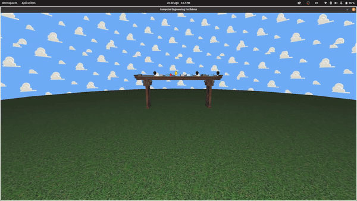
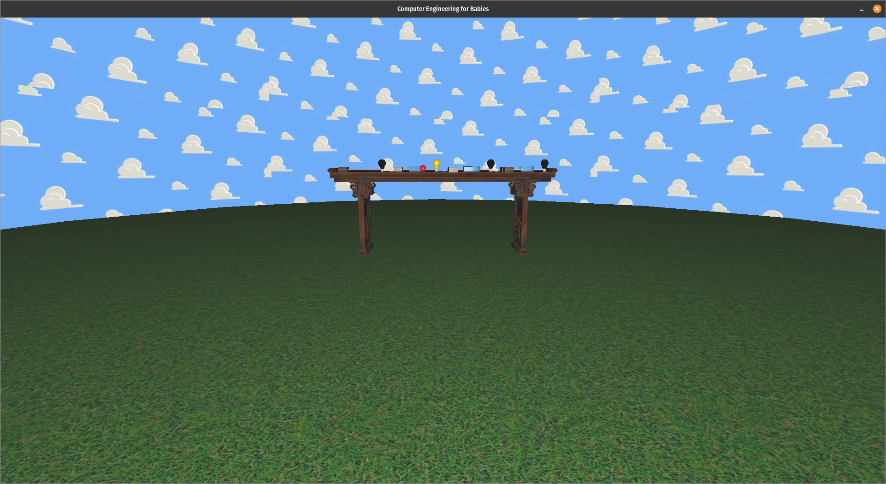
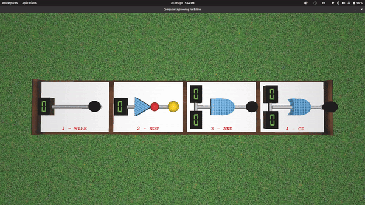

# "Computer Engineering for Babies"
Implementação em OpenGL de circuitos digitais booleanos básicos, em uma simulação interativa e lúdica. Inspirado pelo [livro homônimo de Chase Roberts](https://computerengineeringforbabies.com/?srsltid=AfmBOorB6rgQBVJv4aZhZNOSCN61UN0Kq22ZK3XgHsCch2F3tUFedHHC).

# Contribuição
    Parágrafo listando as contribuição de cada membro da dupla para o trabalho;

**Beatriz Forneck Soviero**
- Ideia do projeto e implementação inicial, a partir dos laboratórios;
- [Implementação dos objetos e circuitos Wire, NOT, AND e OR;](https://github.com/leonardoazzi/compeng-for-babies/pull/14)
- [Criação dos circuitos e lógica troca de estados com mudança de texturas](https://github.com/leonardoazzi/compeng-for-babies/pull/54)
- [Modelos de iluminação](https://github.com/leonardoazzi/compeng-for-babies/pull/38)
- [Animação com curva de Bézier cúbica](https://github.com/leonardoazzi/compeng-for-babies/pull/51)
- [Mapeamento individual dos inputs](https://github.com/leonardoazzi/compeng-for-babies/pull/54)
- [Adição da SkySphere](https://github.com/leonardoazzi/compeng-for-babies/pull/56)
- [Pesquisa e customização de texturas](https://github.com/leonardoazzi/compeng-for-babies/pull/61)

**Leonardo Azzi Martins**
- [Implementação de câmera livre e mudança entre câmeras;](https://github.com/leonardoazzi/compeng-for-babies/pull/28)
- [Teste de intersecção AABB-AABB](https://github.com/leonardoazzi/compeng-for-babies/pull/35)
- [Teste de intersecção raio-AABB para interação com input dos circuitos](https://github.com/leonardoazzi/compeng-for-babies/pull/37)
- [Teste de intersecção esfera-AABB](https://github.com/leonardoazzi/compeng-for-babies/pull/39)
- [Rotação dos circuitos com mouse e teclado](https://github.com/leonardoazzi/compeng-for-babies/pull/50)
- [Wrapping de texturas e customização](https://github.com/leonardoazzi/compeng-for-babies/pull/52)
- [Limita a câmera livre para não atravessar plano xz](https://github.com/leonardoazzi/compeng-for-babies/pull/57)
- [Resolução de bouncing para colisões esfera-AABB e ponto-esfera](https://github.com/leonardoazzi/compeng-for-babies/pull/63)

# Uso de Large Language Models
    Parágrafo curto indicando se a dupla fez uso do ChatGPT (ou alguma outra ferramenta similar, como Github Copilot, OpenAI Codex, etc.) para desenvolvimento do trabalho, descrevendo como a ferramenta foi utilizada e para quais partes do trabalho. O parágrafo deve também incluir uma análise crítica descrevendo quão útil a dupla achou a ferramenta, onde ela auxiliou e onde ela não auxiliou adequadamente;

Utilizamos o Github Copilot com dois objetivos: acelerar a codificação repetitiva com o auto complete, e ajudar na criação de métodos e funções com prompt engineering. Sua principal aplicação foi no módulo collisions.cpp, onde maior parte das implementações necessitou de um material complementar. O auto complete foi bastante útil para diminuir o tempo de desenvolvimento de cada funcionalidade, pois os erros do Copilot são rapidamente minimizados ao prover maior contexto na linha de código - o que gera menos frustrações. Já a função de chat dentro do editor foi utilizada para tentar escrever ou reescrever funções. Esta tarefa depende muito do contexto dado ao Copilot e do prompt descrito. Além disto, como o escopo em geral era maior do que com o auto complete, na maioria das vezes gerou linhas de código que necessitaram minutos ou horas adicionais de debug. O uso da ferramenta pode ajudar a garantir uma solução funcional, mas o aprendizado pleno ainda exige um processo que passa por pesquisa, leitura, entendimento e implementação. Portanto, demos ênfase em referências reais para o desenvolvimento das colisões. Já chat fora do editor foi utilizado como uma forma de traduzir dúvidas ou problemas com um vocabulário menos específico, já que o chat tem o contexto do código-fonte, o que foi útil para direcionar dúvidas e realizar buscas externas. Assim, particularmente, acreditamos que o auto complete foi a melhor funcionalidade do Github Copilot para projetos práticos, principalmente em um semestre reduzido como este.

Utilizamos o ChatGPT para... (Bia, adicionar o que tu falou sobre o passo-a-passo no Blender xD)

# Processo de desenvolvimento e conceitos de CG
    Descrição do processo de desenvolvimento e do uso em sua aplicação dos conceitos de Computação Gráfica estudados e listados nos requisitos acima;

- Câmera

- Objetos

- Testes de intersecção

- Modelos de iluminção

- Mapeamento de texturas

# Imagens da aplicação
    No mínimo duas imagens mostrando o funcionamento da aplicação;

# Manual
    Um manual descrevendo a utilização da aplicação (atalhos de teclado, etc.);

## Interagindo com os circuitos

Ao apontar o mouse para algum display e clicar com o botão esquerdo, o input alterna entre os estados booleanos '0' e '1', afetando a lógica dos circuitos que estão conectados.

## Teclas

| Tecla | Função |
|----------|----------|
| W         | Anda para frente no modo câmera livre |
| S         | Anda para trás no modo câmera livre  |
| A         | Anda para a esquerda no modo câmera livre  |
| D         | Anda para a direita no modo câmera livre  |
| C         | Alterna entre câmera look-at e câmera livre         |
| H         | Exibe textos de debug  |

# Setup
    Explicação de todos os passos necessários para compilação e execução da aplicação;
